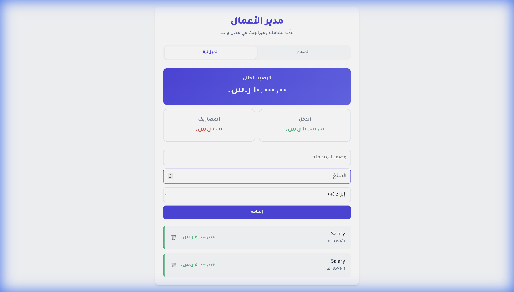

# Business Manager

**Business Manager** is a lightweight, offline-capable web application designed to help users manage their daily tasks and track their personal finances. It features a clean, responsive interface with native Arabic (RTL) support and persists all data locally using the browser's LocalStorage.



## Features

-   **Task Management**: Easily add, complete, and delete daily tasks.
-   **Budget Tracking**: Record income and expenses, and view your current balance.
-   **Data Persistence**: Your data is automatically saved to your browser's LocalStorage, so it's always there when you come back.
-   **Responsive Design**: Works great on both desktop and mobile devices.
-   **RTL Support**: Built from the ground up to support Arabic language and Right-to-Left layout.

## Getting Started

To run the application, simply clone the repository and open the `index.html` file in your web browser. No server or installation is required!

```bash
git clone <repository-url>
cd business-manager
open index.html
```

## Documentation

For a detailed, step-by-step guide on how this application was implemented (in Arabic), please refer to the [Project Report](./Project_Report.md).

## Technologies Used

-   **HTML5**
-   **CSS3** (Custom properties, Flexbox, Grid)
-   **JavaScript** (ES6+, LocalStorage API)

## License

This project is open source and available under the [MIT License](LICENSE).
